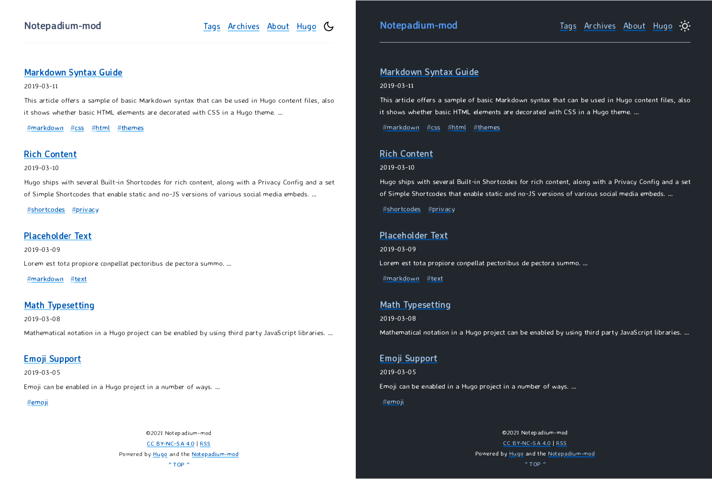

# hugo-notepadium-mod 

 [](https://app.netlify.com/sites/distracted-mirzakhani-1980a4/deploys)

[English](./README.md) | [中文](./README.zh-CN.md) | [✨**Live demo**](https://theme-notemod.littlezhang.com/) | [✨littlezhang's blog](https://www.littlezhang.com)

A fast and simple [Hugo](https://gohugo.io) theme, **100% JavaScript-free**.



<!-- vim-markdown-toc GFM -->

* [Introduce](#introduce)
* [Features](#features)
  * [Different from original notepadium theme:](#different-from-original-notepadium-theme)
  * [Other features](#other-features)
* [Get start](#get-start)
  * [Option 1](#option-1)
  * [Option 2](#option-2)
* [Configure theme](#configure-theme)
* [Update theme](#update-theme)
* [Customize theme](#customize-theme)
* [Thanks](#thanks)
* [License](#license)

<!-- vim-markdown-toc -->

## Introduce

A Hugo theme forked from [early version](https://github.com/cntrump/hugo-notepadium/releases/tag/v2.1.0) of [hugo-notepadium](https://github.com/cntrump/hugo-notepadium).

**[WIP] The project and readme is still working in progress! You can contact me if you have any question.**

Request Hugo Version: [0.68.0+](https://github.com/gohugoio/hugo/releases/)

## Features 

### Different from original notepadium theme:
- grid layout ([Can I use grid?](https://caniuse.com/?search=grid))
- tags cloud
- toc
- preconnect and prefetch for resourses
- inline critical css
- [hugo modules](https://gohugo.io/categories/hugo-modules)
- archive page
- light & dark theme toggle button
- search in site (powered by [stork](https://github.com/jameslittle230/stork)) [How to use it?]()
- more useful Hugo shortcodes
  - tips blocks(alert messages)
  - plist for simple table in markdown

### Other features

- Logo
- Navigation items
- Syntax highlighting
- Math supporting
- Pagination with large number of pages supporting
- Light & Dark
- Custom CSS supporting
- Custom JS supporting
- Custom header right items supporting

## Get start

There are two ways to use this theme for Hugo site.

### Option 1

Use Hugo modules. Hugo Modules is powered by Go Modules. If you have installed [Go](https://golang.org/), this option is **recommended**. More details can be found in [Hugo Docs](https://gohugo.io/hugo-modules/use-modules/)

1. Initialize the hugo module system in your site root: 

```bash
hugo mod init github.com/<your_user>/<your_project>
```

2. Import the theme in your config.toml:

```toml
[module]
  [[module.imports]]
    path = "github.com/qdzhang/hugo-notepadium-mod"
```

### Option 2

Use git submodule.

1. Add theme repository as git submodule

```bash
git submodule add https://github.com/qdzhang/hugo-notepadium-mod.git themes/hugo-notepadium-mod
```

2. Set theme in your config.toml

```toml
theme = "hugo-notepadium-mod"
```

## Configure theme

Almost everything can be configured in the `config.toml` file of your site. If you want to modify the theme, you could go to [Customize theme](#customize-theme)

There is an example `config.toml`:

```toml

baseURL = "https://www.example.com/"
title = "Hugo-notepadium-mod"
copyright = "©2021 hugo-notepadium-mod"

languageCode = "zh-cn"
hasCJKLanguage = true
defaultContentLanguage = "zh-cn"

enableRobotsTXT = true
paginate = 7  # The number of articles in per page
enableEmoji = true

# Enable Disqus
#disqusShortname = "XXX"

# Google Analytics
#googleAnalytics = "UA-123-45"


[module]
  [[module.imports]]
    path = "github.com/qdzhang/hugo-notepadium-mod"  # Use module to use this theme

[minify]
# Deploy with --minify command to minify assets
# Need Hugo version v0.68.0+
  disableCSS = false
  disableHTML = false
  disableJS = false
  disableJSON = false
  disableSVG = false
  disableXML = false
  minifyOutput = true
  [minify.tdewolff]
    [minify.tdewolff.css]
      keepCSS2 = true
      precision = 1
    [minify.tdewolff.html]
      keepComments = false
      keepConditionalComments = true
      keepDefaultAttrVals = true
      keepDocumentTags = true
      keepEndTags = true
      keepQuotes = false
      keepWhitespace = false
    [minify.tdewolff.js]
      keepVarNames = false
      precision = 1
    [minify.tdewolff.json]
      precision = 0
    [minify.tdewolff.svg]
      precision = 1
    [minify.tdewolff.xml]
      keepWhitespace = false

# Configure chroma highlight
# Reference https://gohugo.io/content-management/syntax-highlighting/
# https://gohugo.io/getting-started/configuration-markup#highlight
[markup.highlight]
codeFences = true
guessSyntax = true
noClasses = true
style = "dracula"

[markup.goldmark.renderer]
unsafe = true  # enable raw HTML in Markdown

[markup.tableOfContents]
    endLevel = 3
    ordered = false
    startLevel = 2

[permalinks]
  post = "/:year/:month/:title/"

[author]
    name = "理头张"  # Change to your name


[params]
author = "理头张"
description = "littlezhang's blog"
style = "auto"  # default: auto. light: light theme, dark: dark theme, auto: based on system.
logo = "https://cdn.jsdelivr.net/gh/qdzhang/littlezhang.com/static/logo.png"
slogan = ""
#license = "<a rel=license href=http://creativecommons.org/licenses/by-nc-sa/4.0/></a><br />This work is licensed under a <a rel=license href=http://creativecommons.org/licenses/by-nc-sa/4.0/>Creative Commons Attribution-NonCommercial-ShareAlike 4.0 International License</a>."

# If you use custom css files, declare them here
[params.assets]
css = ["css/fonts.css", "css/custom.css"]

[params.comments]
enable = false  # En/Disable comments globally, default: false. You can always enable comments on per page.

[params.math]
enable = false # load math globally, default: false. You can always enable math on per page.
use = "katex"  # builtin: "katex", "mathjax".  default: "katex"

[params.nav]
showCategories = false       # /categories/
showTags = false             # /tags/

# You can add taxonomies in there, then link new pages in [[params.nav.custom]]
# Reference https://gohugo.io/content-management/taxonomies/
[taxonomies]
  category = "categories"
  tag = "tags"

[[params.nav.custom]]
title = "Index"
url = "/"

[[params.nav.custom]]
title = "Tags"
url = "/tags/"

[[params.nav.custom]]
title = "Archives"
url = "/archives/"

[[params.nav.custom]]
title = "About"
url = "/about/"
```

## Update theme

If you installed the theme by Hugo module

```bash
hugo mod get -u  # This will update all modules
hugo mod get -u github.com/qdzhang/hugo-notepadium-mod  # This will update current theme
```

If you installed the theme by git submodule, first go to the theme directory, then `git pull`

```bash
cd themes/hugo-notepadium-mod && git pull
```

## Customize theme

## Thanks

- [**Hugo**](https://gohugo.io/)
- [**hugo-notepadium**](https://github.com/cntrump/hugo-notepadium)
- [**MathJax**](https://www.mathjax.org/)
- [**Katex**](https://katex.org/)
- [**stork**](https://github.com/jameslittle230/stork)
- Some minimal designs inspired by [**Kev Quirk**](https://kevq.uk/) 

## License

Open source licensed under the [MIT License](./LICENSE).
